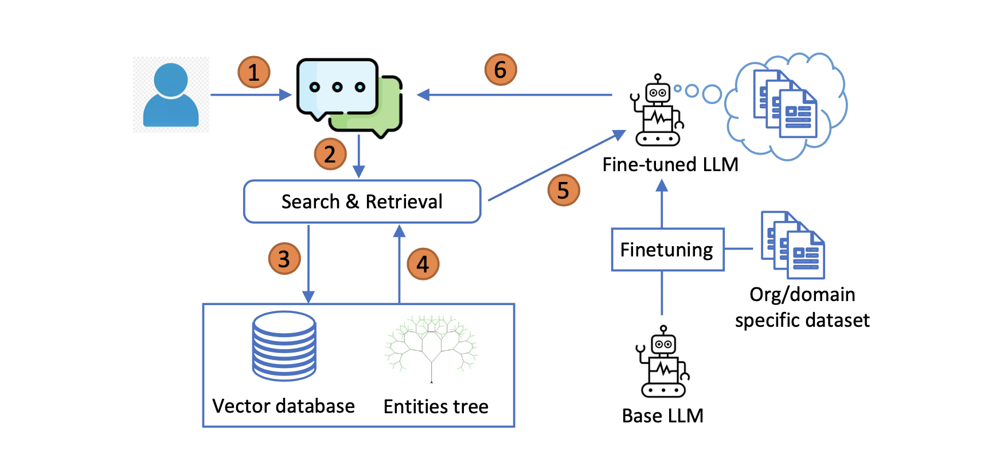

# Tree-RAG for Entity Hierarchy

This code applies the retrieval augmentation technique presented in T-RAG: LESSONS FROM
THE LLM TRENCHES, Fatehkia et al. (2024) (https://arxiv.org/pdf/2402.07483.pdf). 
Moreover, we integrate this to an ESG use case, where customers would input queries about general ESG world data and expect the most truthful answers possible. 

#### Python Requirements

Download [requirements.txt](requirements.txt) and install all dependencies with following command : 

    pip install -r requirements.txt

